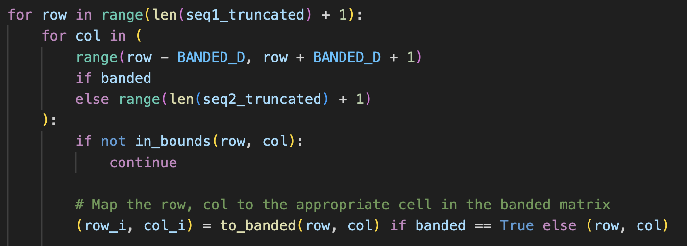

# Project 4 Writeup -- Parker Nilson

## 1. Source Code
(See Appendix)

## 2. Time and Space Complexity
The time complexity of this algorithm is `O(MN)`, where `M` is the length of sequence 1, and `N` is the length of sequence 2, and in the case of the banded algorithm, `K` is the bandwidth (7). This is because in each case, once we have constructed the matrix of edit distances (where each entry builds off of previous entries in a constant fashion), we simply need to look at the final entry to get the answer and perform a linear traversal through the back-pointers to construct the alignment.

### Time Complexity
The general steps of this algorithm are:

#### 1. `O(M) + O(N)`: Truncate the strings to align_length

In python, truncating a string is an O(N) operation since it creates a copy of the part of the string you are truncating to.

#### 2. `O(1)`: Define some inline utility functions like `in_bounds` and `to_banded`, and perform an early return if the sequences are not compatible

#### 3. `O(MN)` unrestricted or `O(MK)` banded: Initialize the edit distances

    - **Unrestricted:**
    In the unrestricted case, this algorithm will create an array of size `M x N` which represents the optimal edit distance of the substring `(0,m) and (0,n) for m in M and n in N`. Therefore, in order to initialize each value of this array it must perform `O(MN)` operations.
    - **Banded:**
    In the banded case, this algorithm will create an array of size `M x K` (or `M x 7`). This is because each row only contains at most 7 items, as this is the bandwidth. Therefore, in order to initialize each of the 7 items on M rows, the runtime of this operation is `O(MK)`.
    - **Note:**
    For each value in the array, the method `in_bounds` is called, however this is a simple pair of if-statements and has runtime `O(1)`, therefore it does not affect the runtime efficiency.

#### 4. `O(M) + O(N)`: Initialize the back pointers

For each of the N items on the first row, and each of the M items on the first column, we add a tuple to a python dictionary to represent a pointer back to the previous character. The runtime efficiency of adding an item to a dictionary in python is `O(1)` thanks to its hashed keys. Therefore, the overall runtime of adding these initial back pointers to the dictionary is `O(M) + O(N)`.

#### 5. `O(MN)` unrestricted or `O(MK)` banded: Construct the EDIT_DISTANCE array and the PREV pointers

In this loop, we are either going through the `M x N` array from left to right, top to bottom, or in the banded case, we are only visiting the 7 items within the band on each row. The row and column numbers are then mapped onto the `M x K` array if necessary with the `to_banded` function (which is a simple pair of if-statements and runs in `O(1)` time).

Since the only operations performed within this for-loop are `if`, `to_banded`, and editing values in the `EDIT_DISTANCE` array and `PREV` dictionary (which has already been established to be a `O(1)` operation thanks to hashed keys), we know that the time complexity must be that of the size of the array being mapped over, in this case `EDIT_DISTANCE`. Thus, in the unrestricted case, the time complexity of this step is `O(MN)`, and in the banded case, the time complexity is `O(MK)`.

#### 6. `O(M + N)`: Backtrack through the PREV pointers to construct the optimal alignment
Finally, this step must be, in the worst case, `O(M + N)`. This is because every pointer only ever points either to the left and/or up. Therefore, if we start at the bottom, right, the worst case scenario is that we must do `N` lookups to get all the way to the left, and then `M` lookups to get all the way to the top. Since looking up an item in a python dictionary uses hashed keys, it is `O(1)`, therefore we must perform at most `O(M + N)` operations. Then, we must reverse both strings, giving us another `O(M + N)` operation.

Therefore, we have `O(M) + O(N) + O(1) + O(MN) + O(M) + O(N) + O(MN) + O(M + N)`, which simplifies to `O(MN)` when we drop non-dominating terms.

### Space Complexity
This algorithm requires `O(MN)` space in the unrestricted case, and `O(MK)` space in the banded case. The following is a breakdown of the memory used by this algorithm:
1. `O(MN)` unrestricted, `O(MK)` banded: The `EDIT_DISTANCE` array.
This array will always have `M` rows, and either `N` columns if unrestricted, or only `K` columns when it is confined to the band.

2. `O(MN)` unrestricted, `O(MK)` banded: The `PREV` dictionary.
This dictionary can have at most `M x N` entries in the unrestricted case because it only contains `(row, col)` keys for rows and columns that exist in the `PREV_DISTANCE` array. In the banded case, it is at most size `M x K` for the same reason. 

3. `O(N)`: Copies of the original sequences
This algorithm includes multiple copies of the original sequences, none of these exceeding the original length. Therefore they account for `O(N)` space complexity.

Therefore, in total, only `O(MN)` space is used in the unrestricted case, and `O(MK)` in the banded case.

## 3. Screenshots

### Unrestricted algorithm, 1000 align length (Completes in under 120 seconds)

### Banded algorithm, 3000 align length (Completes in under 10 seconds)

## 4. Test Alignment
### Sequence 3 x Sequence 10, First 100 characters, unrestricted n=1000

### Sequence 3 x Sequence 10, First 100 characters, banded n=3000

# Appendix
## Source Code

